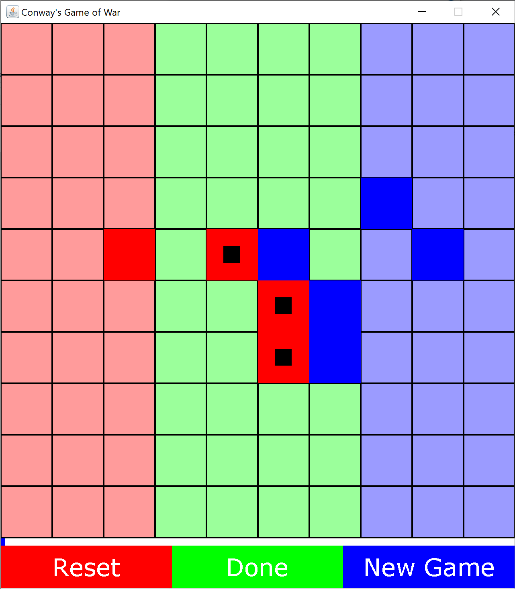
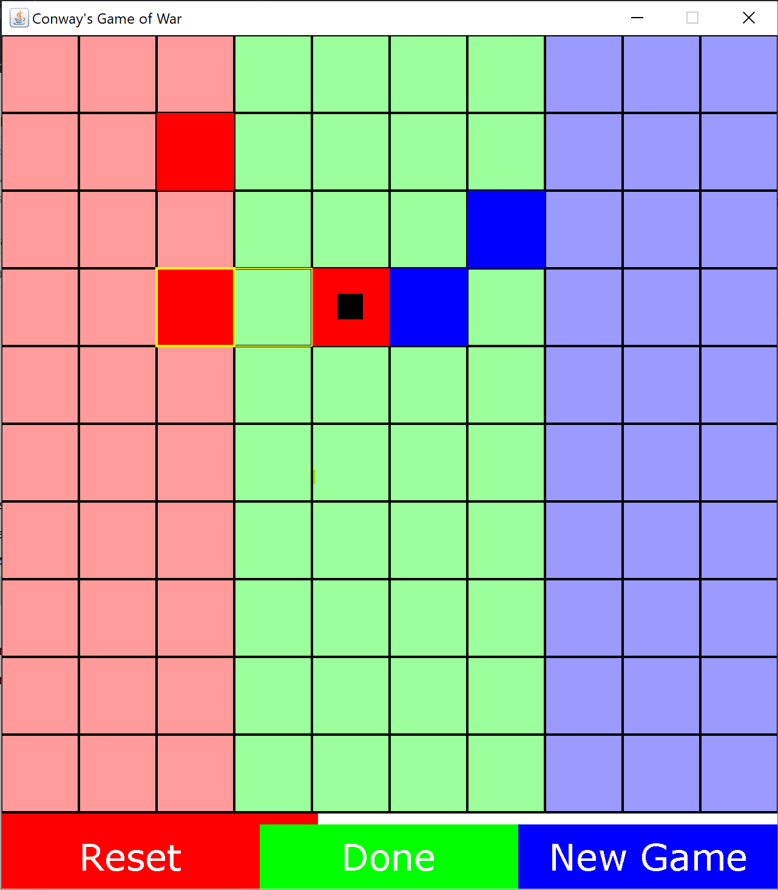

# Conway's Game of War
Experimental board game inspired by cellular automata/Conway's Game of Life.

## Rules
* 2 teams, red and blue
* A team can spawn its units in the base area marked by the team colour
* Turn-based - red starts
* 5 moves per turn - spawning or moving a unit counts as a move
* A singular unit adjacent to an enemy unit will die
* A unit adjacent to at least one friendly unit can survive at most two adjacent enemy units
* A unit surrounded by three or more enemy units will die
* If a unit enters the enemy base the enemy can no longer spawn new units
* The game is won when:
  * The enemy has no units left
  **and**
  * The enemy cannot spawn any new units

## Screenshots

